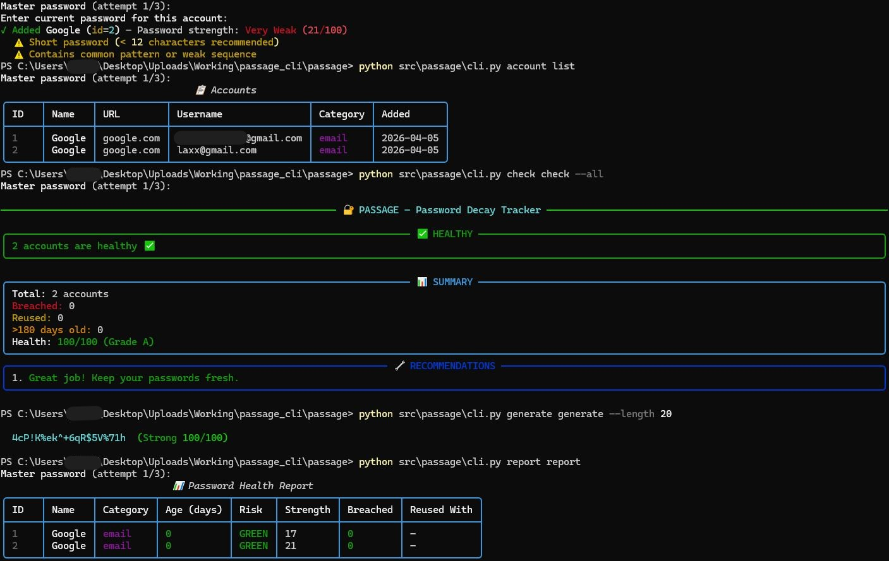
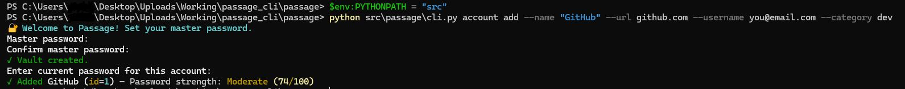

# Passage — Password Decay Tracker


Track password age, detect reuse, and check breach exposure without ever storing plaintext passwords.

---
## Screenshots

### Account Management & Health Check


### Adding an Account


## Features

- **Password age tracking** — GREEN / YELLOW / ORANGE / RED risk levels
- **Breach checking** — HIBP k-anonymity (only first 5 chars of SHA-1 sent)
- **Reuse detection** — SimHash fuzzy fingerprint, no plaintext stored
- **Encrypted vault** — AES-256 via PBKDF2-derived master password key
- **Rich terminal output** — dashboards, tables, summaries
- **Reports** — HTML, CSV, JSON export
- **Password generator** — with strength scoring
- **Security audit** — flags weak or old passwords

---

## Installation

```powershell
unzip passage.zip
cd passage
pip install -e .
```

---

## Quick Start

> **PowerShell - set this every session:**
> ```powershell
> $env:PYTHONPATH = "src"
> ```

```powershell
# Add an account
python src\passage\cli.py account add --name "Google" --url google.com --username you@gmail.com --category email

# List accounts
python src\passage\cli.py account list

# Check all passwords (age, breaches, reuse)
python src\passage\cli.py check check --all

# Check single account
python src\passage\cli.py check check --id 1

# Find reused passwords only
python src\passage\cli.py check check --reused

# Generate a strong password
python src\passage\cli.py generate generate --length 20

# Generate and replace password for account id 1
python src\passage\cli.py generate generate --length 20 --replace 1

# Security audit
python src\passage\cli.py audit audit --weak

# Report (terminal table)
python src\passage\cli.py report report

# Report (export to HTML)
python src\passage\cli.py report report --export health.html

# Report (one-line summary)
python src\passage\cli.py report report --summary

# Show / reset config
python src\passage\cli.py config config --show
python src\passage\cli.py config config --reset
```

---

## Categories
`email` · `social` · `finance` · `work` · `dev` · `other`

---

## Risk Levels

| Level | Age |
|---|---|
| 🟢 GREEN | < 90 days |
| 🟡 YELLOW | 90 – 180 days |
| 🟠 ORANGE | 180 – 365 days |
| 🔴 RED | 365+ days |

---

## What Gets Stored

Passage stores **zero plaintext passwords**. Only:

| Stored | Purpose |
|---|---|
| `bcrypt` hash | Detect if password changed |
| `fuzzy_hash` (SimHash 64-bit) | Reuse detection without plaintext |
| `sha1_prefix` (first 5 chars) | HIBP breach lookup |
| Metadata (age, category, username) | Reporting & alerts |

---

## Security Architecture

```
Master Password
      │
      ▼
PBKDF2-HMAC-SHA256 (310,000 iterations)
      │
      ▼
AES-256 key (Fernet)
      │
      ▼
Encrypted SQLite (~/.passage/passage.db)
```

- Vault decrypted **in memory only** - never written as plaintext
- Re-encrypted on every exit
- 3 wrong password attempts → 5-second cooldown
- Auto-lock after 5 minutes (configurable)

---

## Reset / Clear All Data

```powershell
Remove-Item -Recurse -Force "$env:USERPROFILE\.passage"
```

---

## Configuration

Located at `~/.passage/config.yaml` — created automatically on first run.

```yaml
security:
  pbkdf2_iterations: 310000
  reuse_threshold: 0.85
  auto_lock_minutes: 5

hibp:
  enabled: true
  cache_days: 30
  timeout_seconds: 10

alerts:
  age_warning_days: 90
  age_critical_days: 365
```

---

## File Structure

```
passage/
├── src/passage/
│   ├── cli.py                  # Main entry point
│   ├── commands/
│   │   ├── account.py          # add, list, edit, remove
│   │   ├── check.py            # health check
│   │   ├── report.py           # reports (table/json/csv/html)
│   │   ├── tools.py            # generate, audit
│   │   └── config_cmd.py       # config, remind
│   ├── core/
│   │   ├── config.py           # YAML config + defaults
│   │   ├── crypto.py           # PBKDF2, Fernet, bcrypt, SimHash
│   │   ├── database.py         # SQLite schema + CRUD
│   │   ├── hibp.py             # HIBP breach checking
│   │   ├── session.py          # Master password + VaultSession
│   │   └── strength.py         # Strength scoring + generator
│   └── utils/
│       └── render.py           # Rich terminal rendering
├── tests/
│   └── test_passage.py         # 39 tests
├── scripts/
│   └── completion.sh           # bash/zsh completion
├── config.example.yaml
├── pyproject.toml
├── requirements.txt
└── README.md
```

---

## Tests

```bash
pip install -e ".[dev]"
pytest tests/ -v --cov=passage
```

Covers: crypto, bcrypt, SimHash, strength scoring, password generation, database CRUD, HIBP cache logic, health scoring, and performance (500 accounts).

---

## License

MIT
##
Prasad
